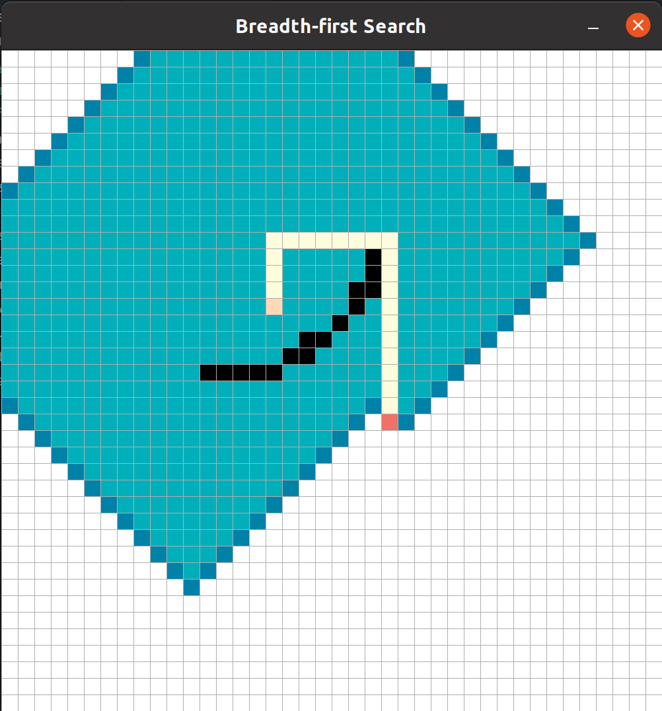

# Pathfinding Visualizer

Welcome to Pathfinding Visualizer using Python!



I came across this [Pathfnding visualizer project](https://github.com/clementmihailescu/Pathfinding-Visualizer) of Clément Mihailescu using CSS and Javascript, and I thought that it was a great idea to visualize the algorithms in action. I implemented some of them in Python, and used [pygame](https://www.pygame.org/docs/) and [pygame-gui](https://pygame-gui.readthedocs.io/en/latest/index.html) to build the user interface. 

Feel free to contact me if there is any error in the code or if you want to contribute :) 

- [Meet the algorithms](#meet-the-algorithms)
- [Installation](#installation)
- [How to use it?](#how-to-use-it)

## Meet the algorithms

A pathfinding algorithm seeks to find the shortest path between two points. 
All of the algorithms on this application are adapted for a 2D grid, where 90 degree turns have a "cost" of 1 and movements from a node to another have a "cost" of 1.

| Algorithms | Type | Presentation | Implementation | Optimal <br> (guarantees the shortest path) |
| ---------- | ---- | ------------ | -------------- | ------------------------------------------- |
| __Dijkstra's Algorithm__ | Weighted | The father of pathfinding algorithms. | Frontier = PriorityQueue | Yes |
| __A* Search__ | Weighted | Arguably the best pathfinding algorithm. Uses heuristics to guarantee the shortest path much faster than Dijkstra's Algorithm. | Frontier = PriorityQueue; f = g + h where g is constant to one and h is the Manhattan distance | Yes |
| __Greedy Best-first Search__ | Weighted | A faster, more heuristic-heavy version of A*. Expands the node that is closest to the goal. Nodes are evaluated by the heuristic function. | Frontier = PriorityQueue; f = h where h is the Manhattan distance | No |
| __Breath-first Search__ | Unweighted | A great algorithm. Expands all the nodes at a given depth in the search tree before any nodes at the next level.  | Frontier = Queue | Yes
| __Depth-first Search__ | Unweighted | A very bad algorithm for pathfinding. Expands the deepest node in the current frontier. | Frontier = LifoQueue | No

## Installation

1. Clone this repository on your computer. 
```shell
git clone https://github.com/Elxse/pathfinding-visualizer.git
```
2. `cd` in the new directory and install all dependencies.
```shell
cd pathfinding-visualizer
pip3 install -r requirements.txt
```

## How to use it?

### Steps 

1. Execute the `main.py` file.
```shell
python3 main.py
```

2. Choose one of the algorithm by clicking on the corresponding button. 
3. Click on the grid to place two dots, the start and end nodes. 
4. You can add walls, meaning that a path cannot cross through them.
5. Enter `space` to run the algorithm.

### Actions
- Left click : place dots
- Right click :  erase dots
- `space` : run the algorithm 
- `Ctrl+c` : initialize a new grid
- `Ctrl+q` : go back to choose another algorithm or quit the application

